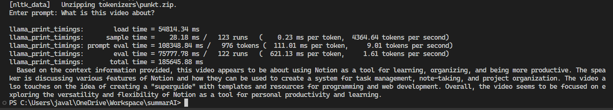

<div align="center">
</img>
<h1 align="center">🦙 SummarAI 🤖</h1>
</div>

### Table of Contents

- [📢 What is _SummarAI_?](#-what-is-summarAI)
- [⚙️ Execution](#%EF%B8%8F-execution)
- [⭐ Current Features](#-current-features)
- [⚒️ Troubleshooting](#-troubleshooting)

## 📢 What is _SummarAI_?

**SummarAI** employs the combination of _PyMovie_ and _Whisper_ to provide video transcription services, allowing users to ask questions about the video's content with the help of _Llama2_ and _LlamaIndex_ for more engaging and insightful interactions.

**SummarAI** is divided into three different files:

- `1_extract_audio.py`: This file utilizes the _PyMovie_ library to extract audio from the specified video in a matter of seconds.

- `2_transcribe_audio.py`: In this case, the "speech recognition" model from _OpenAI_, known as _Whisper_, is used to transcribe the audio into a text file.

- `3_llm_over_data`: Finally, this file makes use of _LlamaIndex_, which, based on the _Llama2-13B_ model, provides context to the data from the previously prepared video and responds accurately within that context.

## ⚙️ Execution

To run the **SummarAI**, you can use `pipenv`. First, ensure you have `pipenv` installed. Then, navigate to the root directory of the project, where you can install the dependencies and activate the virtual environment using the following commands:

```bash
pipenv install
pipenv shell
```

Afterwards, simply run the file you want using one of these commands:

```bash
python 1_extract_audio.py
python 2_transcribe_audio.py
python 3_llm_over_data.py
```

## ⭐ Current features

✅ Extract audio from videos

✅ Transcribe audio using Whisper

✅ Resolve your inquiries with the assistance of Llama2

<div align="center">
  </img>
</div>

## ⚒️ Troubleshooting

If you encounter issues while installing the `llama-cpp-python` library, you may need to run the following commands:

```bash
set CMAKE_ARGS=-DLLAMA_CUBLAS=on
set FORCE_CMAKE=1
```

If the error persists, please check your C compiler (_gcc_) or, if you are using Windows, update/install the _"Desktop development with C++"_ feature by utilizing the [Microsoft C++ Build Tools](https://visualstudio.microsoft.com/es/visual-cpp-build-tools/)

<hr>

<div align="center">
    <span>Made with ❤️ by <b><a href="https://www.linkedin.com/in/jalvarezz13/">jalvarezz13</a></b></span>
    <br>
    <small>Logo generated using <a href="https://openai.com/dall-e-3">DALL-E 3</a></small>
</div>
